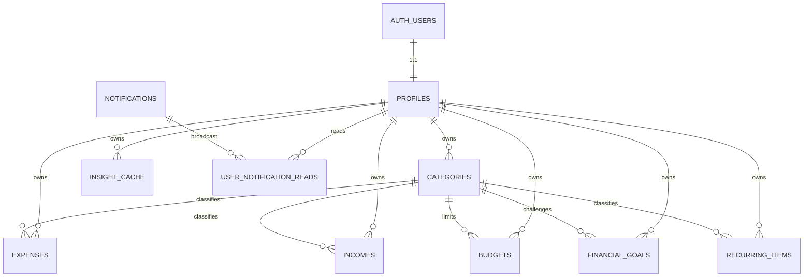
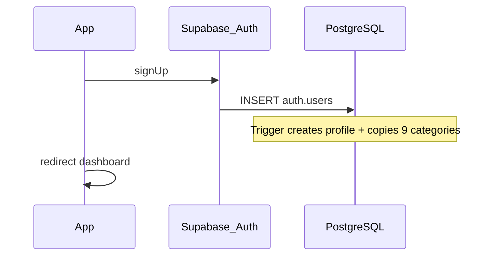

# Database — PoysaPath

> **Companion:** [planning.md](./planning.md) · [planning-design.md](./planning-design.md)  
> **Security rules:** [planning.md §3](./planning.md#3-security-canonical)  
> **Last updated:** June 7, 2026

## Current state

- PostgreSQL on Supabase; RLS enabled on user-owned tables.
- Sign-up copies **9 expense + 4 income** system categories into per-user rows.
- `categories.kind`: `expense` | `income` (`022_incomes.sql`).
- Migrations `001`–`022` in `supabase/migrations/`.
- **Before production:** run two-user RLS test (`supabase/README.md`).

---

## 1. Entity relationship (v1)

| Table | Purpose |
|-------|---------|
| `profiles` | 1:1 with `auth.users`; display name |
| `categories` | Per-user copies of defaults + custom; `kind` = expense or income |
| `expenses` | Amount, category, date, note, payment_method |
| `incomes` | Income amount, category, date, note, payment_method (`022`) |
| `budgets` | Per category per month |
| `financial_goals` | Savings, emergency, debt payoff, and category spend-less goals |
| `recurring_items` | Recurring expenses and income reminders |
| `insight_cache` | Cached weekly Gemini text |
| `notifications` | App-wide announcements (read via `user_notification_reads`) |

---

## 2. Sign-up flow

---

## 3. Row Level Security

All policies assume `auth.uid()` from the user JWT (anon key + session).

| Table | SELECT | INSERT | UPDATE | DELETE |
|-------|--------|--------|--------|--------|
| `profiles` | `id = auth.uid()` | `id = auth.uid()` | `id = auth.uid()` | — |
| `categories` | `user_id = auth.uid()` | `user_id = auth.uid()` | `user_id = auth.uid()` | `user_id = auth.uid()` |
| `expenses` | `user_id = auth.uid()` | `user_id = auth.uid()` | `user_id = auth.uid()` | `user_id = auth.uid()` |
| `incomes` | `user_id = auth.uid()` | `user_id = auth.uid()` | `user_id = auth.uid()` | `user_id = auth.uid()` |
| `budgets` | `user_id = auth.uid()` | `user_id = auth.uid()` | `user_id = auth.uid()` | `user_id = auth.uid()` |
| `financial_goals` | `user_id = auth.uid()` | `user_id = auth.uid()` | `user_id = auth.uid()` | `user_id = auth.uid()` |
| `recurring_items` | `user_id = auth.uid()` | `user_id = auth.uid()` | `user_id = auth.uid()` | `user_id = auth.uid()` |
| `insight_cache` | `user_id = auth.uid()` | `user_id = auth.uid()` | `user_id = auth.uid()` | `user_id = auth.uid()` |
| `notifications` | authenticated read (broadcast) | service/admin only | — | — |
| `user_notification_reads` | `user_id = auth.uid()` | `user_id = auth.uid()` | — | `user_id = auth.uid()` |

**App rule:** server code must still set/filter `user_id` from session where possible (defense in depth). See [planning.md §3](./planning.md#3-security-canonical).

---

## 4. Key columns (cheat sheet)

**expenses:** `user_id`, `category_id`, `amount` (>0), `expense_date`, `note?`, `payment_method?`  
**incomes:** `user_id`, `category_id`, `amount` (>0), `income_date`, `note?`, `payment_method?`  
**budgets:** unique `(user_id, category_id, month)` — `month` = first day of month  
**financial_goals:** `goal_type`, `target_amount`, `current_amount`, optional `category_id`, `target_month`, `due_date`  
**recurring_items:** `recurring_type`, `amount`, optional `category_id`, `frequency`, `next_due_date`, `reminder_days`  
**insight_cache:** unique `(user_id, week_start)`

**Indexes (main):** `expenses(user_id, expense_date DESC)`, `expenses(user_id, category_id)`.

---

## 5. Migrations (repo)

| File | Contents |
|------|----------|
| `001_initial_schema.sql` | profiles, categories, expenses, RLS, seed templates, sign-up trigger |
| `002_backfill_existing_users.sql` | Users created before trigger |
| `003_insight_cache.sql` | Weekly insight cache |
| `004_budgets.sql` | Budgets table + RLS |
| `005_notifications.sql` | Broadcast notifications + read state |
| `006_user_gemini_credentials.sql` | Encrypted per-user Gemini API keys |
| `007_goals_recurring.sql` | Financial goals, recurring money reminders, RLS |

Apply in order via Supabase SQL Editor or CLI.

---

## 6. Default categories (seeded on sign-up)

Food, Transport, Rent/Housing, Utilities, Shopping, Health, Entertainment, Education, Other (9 rows copied per user).

---

## 7. Future: shared household (not v1)

Would need `workspaces` + membership and RLS on `workspace_id`. Do not add until product Phase 4.

---

*Product context: [planning.md](./planning.md).*
