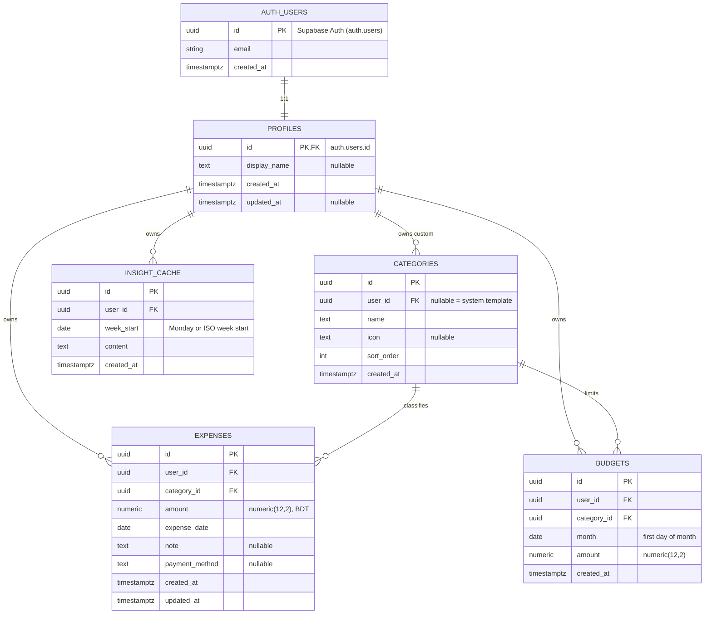
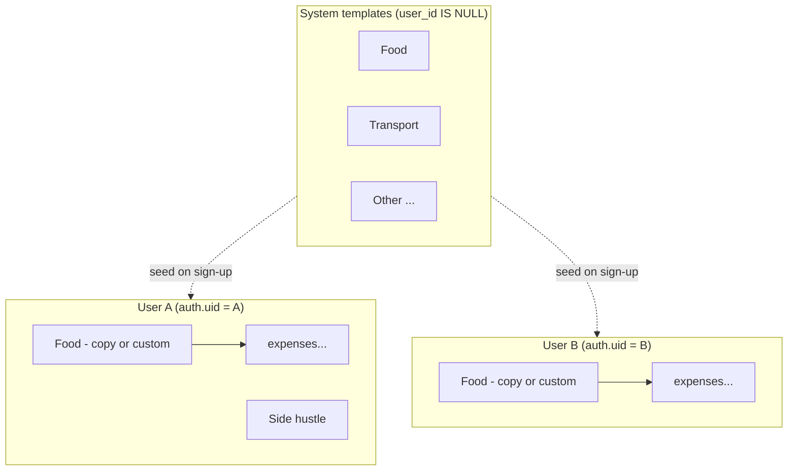
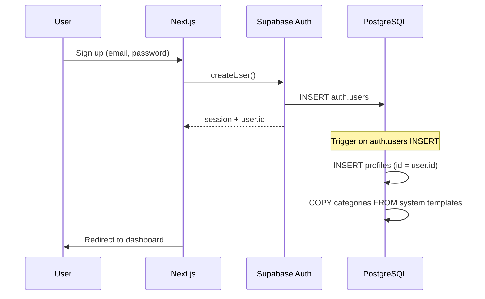
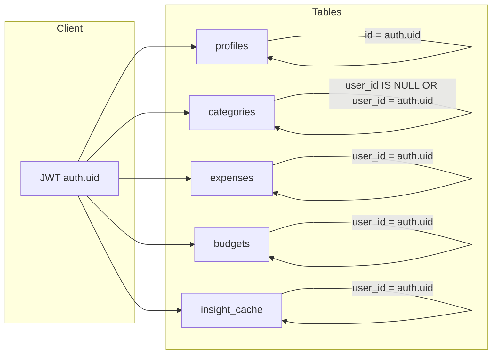
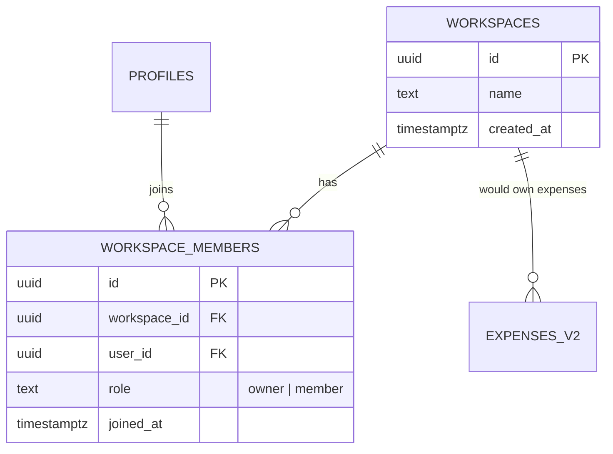

# Database Diagram — PoysaPath

> **Companion to:** [planning.md](./planning.md) · [planning-design.md](./planning-design.md)  
> **Database:** Supabase (PostgreSQL)  
> **Model:** Multi-tenant — each user’s data isolated via `user_id` + RLS  
> **Last updated:** May 17, 2026 — migrations in repo; apply via SQL Editor

---

## 1. Entity Relationship Diagram (v1)



### Relationship summary

| From | To | Cardinality | Notes |
|------|-----|-------------|-------|
| `auth.users` | `profiles` | 1 : 1 | Same `id`; profile created on sign-up |
| `profiles` | `categories` | 1 : N | Only rows where `user_id = profiles.id` |
| `profiles` | `expenses` | 1 : N | All expenses belong to one user |
| `categories` | `expenses` | 1 : N | Category must be visible to user (own or system) |
| `profiles` | `budgets` | 1 : N | Optional v1 table |
| `categories` | `budgets` | 1 : N | One budget per category per month per user |
| `profiles` | `insight_cache` | 1 : N | One row per user per week (unique) |

---

## 2. Categories — system vs user-owned



**v1 approach (recommended in planning):** On sign-up, **copy** system default categories into rows with `user_id = new_user.id`. Users can rename/add without affecting others.

**Alternative:** Keep a single system set (`user_id IS NULL`) and only allow custom rows for extras — simpler DB, but users cannot rename defaults without affecting everyone (not recommended for multi-user).

---

## 3. Sign-up & data flow



---

## 4. Table definitions (implementation reference)

### `public.profiles`

| Column | Type | Constraints |
|--------|------|-------------|
| `id` | `uuid` | PK, FK → `auth.users(id)` ON DELETE CASCADE |
| `display_name` | `text` | NULL |
| `created_at` | `timestamptz` | NOT NULL, DEFAULT `now()` |
| `updated_at` | `timestamptz` | NULL |

---

### `public.categories`

| Column | Type | Constraints |
|--------|------|-------------|
| `id` | `uuid` | PK, DEFAULT `gen_random_uuid()` |
| `user_id` | `uuid` | NULL = system template; else FK → `profiles(id)` ON DELETE CASCADE |
| `name` | `text` | NOT NULL |
| `icon` | `text` | NULL |
| `sort_order` | `int` | NOT NULL, DEFAULT 0 |
| `created_at` | `timestamptz` | NOT NULL, DEFAULT `now()` |

**Indexes**
- `idx_categories_user_id` ON (`user_id`)

**Business rules**
- System rows: `user_id IS NULL` (seed templates only; not editable by users if using copy-on-signup).
- User rows: `user_id = auth.uid()`.

---

### `public.expenses`

| Column | Type | Constraints |
|--------|------|-------------|
| `id` | `uuid` | PK, DEFAULT `gen_random_uuid()` |
| `user_id` | `uuid` | NOT NULL, FK → `profiles(id)` ON DELETE CASCADE |
| `category_id` | `uuid` | NOT NULL, FK → `categories(id)` |
| `amount` | `numeric(12,2)` | NOT NULL, CHECK (`amount` > 0) |
| `expense_date` | `date` | NOT NULL, DEFAULT `CURRENT_DATE` |
| `note` | `text` | NULL |
| `payment_method` | `text` | NULL — e.g. `cash`, `bkash`, `nagad`, `card`, `other` |
| `created_at` | `timestamptz` | NOT NULL, DEFAULT `now()` |
| `updated_at` | `timestamptz` | NOT NULL, DEFAULT `now()` |

**Indexes**
- `idx_expenses_user_date` ON (`user_id`, `expense_date` DESC)
- `idx_expenses_user_category` ON (`user_id`, `category_id`)

**Business rules**
- `category_id` must reference a category the user can use (own category or valid seeded row for that user).

---

### `public.budgets` (optional v1)

| Column | Type | Constraints |
|--------|------|-------------|
| `id` | `uuid` | PK, DEFAULT `gen_random_uuid()` |
| `user_id` | `uuid` | NOT NULL, FK → `profiles(id)` ON DELETE CASCADE |
| `category_id` | `uuid` | NOT NULL, FK → `categories(id)` ON DELETE CASCADE |
| `month` | `date` | NOT NULL — store as first day of month (e.g. `2026-05-01`) |
| `amount` | `numeric(12,2)` | NOT NULL, CHECK (`amount` > 0) |
| `created_at` | `timestamptz` | NOT NULL, DEFAULT `now()` |

**Unique**
- `uq_budgets_user_category_month` ON (`user_id`, `category_id`, `month`)

**Indexes**
- `idx_budgets_user_month` ON (`user_id`, `month`)

---

### `public.insight_cache` (optional v1)

| Column | Type | Constraints |
|--------|------|-------------|
| `id` | `uuid` | PK, DEFAULT `gen_random_uuid()` |
| `user_id` | `uuid` | NOT NULL, FK → `profiles(id)` ON DELETE CASCADE |
| `week_start` | `date` | NOT NULL |
| `content` | `text` | NOT NULL |
| `created_at` | `timestamptz` | NOT NULL, DEFAULT `now()` |

**Unique**
- `uq_insight_cache_user_week` ON (`user_id`, `week_start`)

---

## 5. Row Level Security (RLS) map



| Table | SELECT | INSERT | UPDATE | DELETE |
|-------|--------|--------|--------|--------|
| `profiles` | `id = auth.uid()` | `id = auth.uid()` | `id = auth.uid()` | — (Phase 2) |
| `categories` | system OR `user_id = auth.uid()` | `user_id = auth.uid()` | `user_id = auth.uid()` | `user_id = auth.uid()` |
| `expenses` | `user_id = auth.uid()` | `user_id = auth.uid()` | `user_id = auth.uid()` | `user_id = auth.uid()` |
| `budgets` | `user_id = auth.uid()` | `user_id = auth.uid()` | `user_id = auth.uid()` | `user_id = auth.uid()` |
| `insight_cache` | `user_id = auth.uid()` | `user_id = auth.uid()` | `user_id = auth.uid()` | `user_id = auth.uid()` |

> Enable RLS on all `public` tables: `ALTER TABLE ... ENABLE ROW LEVEL SECURITY;`

---

## 6. Physical schema diagram (PostgreSQL / Supabase)

```
┌─────────────────────┐
│   auth.users        │  (managed by Supabase Auth)
│─────────────────────│
│ id          uuid PK │
│ email       text    │
│ ...                 │
└──────────┬──────────┘
           │ 1:1 ON DELETE CASCADE
           ▼
┌─────────────────────┐
│   public.profiles   │
│─────────────────────│
│ id          uuid PK │◄──────────────────────────────┐
│ display_name text   │                               │
│ created_at  tstz    │                               │
│ updated_at  tstz    │                               │
└──────────┬──────────┘                               │
           │                                          │
     ┌─────┴─────┬─────────────┬──────────────┐      │
     │ 1:N       │ 1:N         │ 1:N          │ 1:N  │
     ▼           ▼             ▼              ▼      │
┌──────────┐ ┌──────────┐ ┌──────────┐ ┌──────────────┐
│categories│ │ expenses │ │ budgets  │ │insight_cache │
│──────────│ │ ──────── │ │ ──────── │ │ ──────────── │
│ id    PK │ │ id    PK │ │ id    PK │ │ id        PK │
│user_id FK│◄┤user_id FK│ │user_id FK│ │ user_id   FK │
│ name     │ │category  │ │category  │ │ week_start   │
│ icon     │ │  _id FK ─┼►│  _id FK ─┼►│ content      │
│sort_order│ │ amount   │ │ month    │ │ created_at   │
│created_at│ │expense_  │ │ amount   │ └──────────────┘
└──────────┘ │  date    │ │created_at│
             │ note     │ └──────────┘
             │payment_  │
             │ method   │
             │created_at│
             │updated_at│
             └──────────┘

UNIQUE (budgets):     (user_id, category_id, month)
UNIQUE (insight_cache): (user_id, week_start)
```

---

## 7. Seed data — system categories

Inserted once (migration); `user_id = NULL`:

| sort_order | name | icon (example) |
|------------|------|----------------|
| 1 | Food | 🍽️ |
| 2 | Transport | 🚌 |
| 3 | Rent / Housing | 🏠 |
| 4 | Utilities | 💡 |
| 5 | Shopping | 🛒 |
| 6 | Health | 💊 |
| 7 | Entertainment | 🎬 |
| 8 | Education | 📚 |
| 9 | Other | 📦 |

**Sign-up trigger** copies these nine rows into `categories` with `user_id = NEW.id`.

---

## 8. Phase 2+ — shared household (not v1)

Shown for future reference only; **do not create these tables in v1**.



When adding shared mode, `expenses` would gain `workspace_id` (nullable) and RLS would check membership — out of scope until explicitly planned.

---

## 9. Migration checklist

- [x] Create `profiles`, `categories`, `expenses` tables — `supabase/migrations/001_initial_schema.sql`
- [x] Create `budgets` table — `004_budgets.sql`
- [x] Create `insight_cache` table — `003_insight_cache.sql`
- [x] Add FKs and CHECK constraints
- [x] Add indexes and UNIQUE constraints
- [x] Enable RLS + policies on all tables
- [x] Seed system categories (`user_id IS NULL`)
- [x] Create `on_auth_user_created` trigger → profile + category copy
- [ ] Verify with **two test users** — no cross-read (manual; see `supabase/README.md`)
- [x] Backfill script for pre-migration sign-ups — `002_backfill_existing_users.sql`

---

## 10. Related files (after implementation)

```
supabase/
└── migrations/
    ├── 001_profiles.sql
    ├── 002_categories.sql
    ├── 003_expenses.sql
    ├── 004_budgets.sql          # optional
    ├── 005_insight_cache.sql    # optional
    ├── 006_rls_policies.sql
    ├── 007_seed_categories.sql
    └── 008_on_signup_trigger.sql
```

---

*See [planning.md §6](./planning.md#6-data-model-supabase) for feature context and API usage.*
