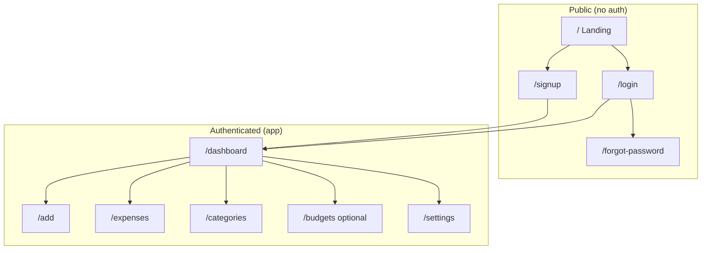
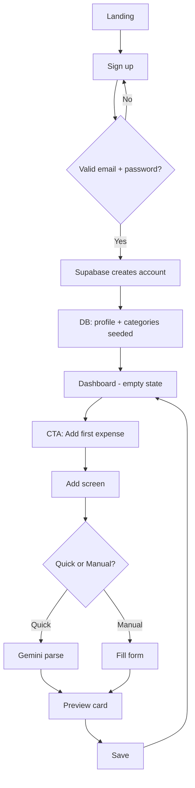
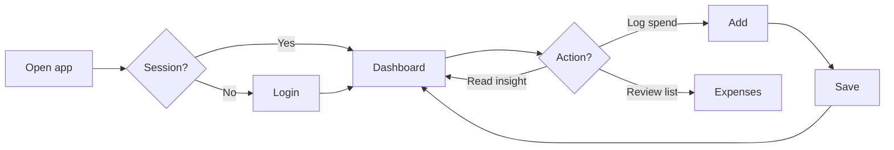
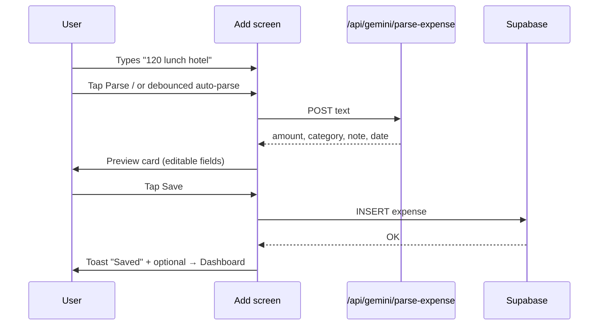
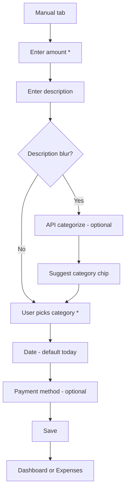
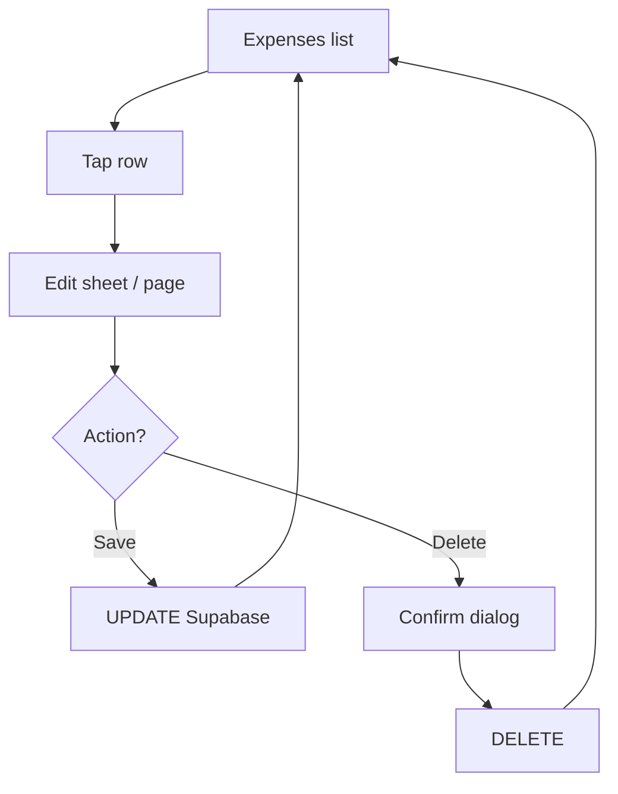
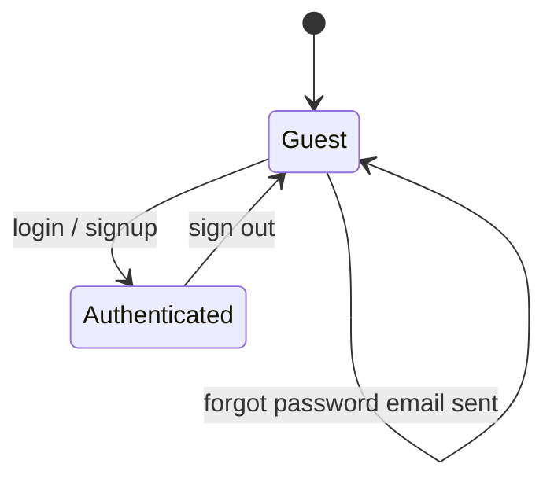

# Design Plan — PoysaPath

> **Companion to:** [planning.md](./planning.md) · [planning-db.md](./planning-db.md)  
> **Focus:** User flows, screens, navigation, UI patterns, and states  
> **Platform:** Mobile-first responsive web (375px primary)  
> **Last updated:** May 17, 2026 — Phase 0–1 UI partially implemented

---

## 1. Design goals

| Goal | How we achieve it |
|------|-------------------|
| **Fast daily logging** | Dashboard → Add in ≤2 taps; Gemini quick entry on Add screen |
| **Clear at a glance** | Today + month totals on dashboard; category breakdown visible without scrolling much |
| **Trustworthy multi-user** | No shared UI between accounts; sign out obvious in Settings |
| **Graceful AI** | Preview before save; manual fallback when Gemini fails |
| **Mobile comfort** | Bottom nav, 44px+ targets, thumb zone for primary actions |

**v1 UI language:** English. **Input:** English, Bangla, Banglish (Gemini parsing only).

---

## 2. Personas

### Primary — Daily tracker (mobile)
- **Who:** Individual in Bangladesh tracking personal spending  
- **Device:** Phone browser (375–430px), occasional laptop  
- **Behavior:** Logs 2–8 expenses per day; checks totals in the evening  
- **Needs:** Speed, BDT formatting, simple categories, optional bKash/cash labels  
- **Pain:** Typing full forms; forgetting what category to pick  

### Secondary — Occasional desktop user
- **Who:** Same user at desk  
- **Needs:** Wider layout, same flows; filters on expense list more usable  

> v1 does **not** design for shared household or admin roles.

---

## 3. Information architecture

### 3.1 Sitemap



### 3.2 Route access

| Route | Auth | Redirect if wrong state |
|-------|------|-------------------------|
| `/` | Public | Logged in → `/dashboard` |
| `/login`, `/signup`, `/forgot-password` | Public | Logged in → `/dashboard` |
| `/dashboard`, `/add`, `/expenses`, … | Required | Not logged in → `/login` |

### 3.3 Navigation model

**Mobile (primary):** fixed **bottom tab bar** (4 items + center FAB optional)

| Tab | Icon | Route | Label |
|-----|------|-------|-------|
| Home | house | `/dashboard` | Home |
| Expenses | list | `/expenses` | Expenses |
| **Add** | **+** (FAB) | `/add` | Add |
| More | grid/menu | sheet → Categories, Budgets, Settings | More |

**Alternative (simpler v1):** 4 tabs without FAB — Add is a full tab.

**Desktop (≥768px):** left sidebar with same destinations; content area wider; bottom nav hidden.

```
Mobile                         Desktop
┌─────────────────┐           ┌──────┬────────────────────┐
│     Header      │           │ Side │      Header          │
│     Content     │           │ bar  │      Content         │
│                 │           │      │                      │
├─────────────────┤           │      │                      │
│ [Home][List][+] │           └──────┴────────────────────┘
└─────────────────┘
```

---

## 4. Core user flows

### 4.1 First-time user (sign up → first expense)



**Empty dashboard copy:** “No expenses yet. Tap + to log your first one.”

---

### 4.2 Returning user (daily check-in)



**Target:** Login → saved expense in **under 30 seconds** on mobile (quick entry path).

---

### 4.3 Add expense — Quick (Gemini)



**Rules**
- Always show **preview** before save — user can edit amount, category, date, note.
- Loading: spinner on Parse button; disable Save until parse completes or user switches to Manual.
- Error: inline message + “Enter manually” link.

---

### 4.4 Add expense — Manual



**Auto-categorize:** non-blocking; show suggested category as pre-selected chip user can override.

---

### 4.5 Edit / delete expense



**Delete:** require confirmation (“Delete this expense?”) — no undo in v1.

---

### 4.6 Weekly insight (dashboard)

```mermaid
flowchart TD
    A[User opens Dashboard] --> B{Cached insight for this week?}
    B -->|Yes| C[Show insight card]
    B -->|No| D[Compute category totals client or server]
    D --> E[POST /api/gemini/weekly-insight]
    E --> F{Success?}
    F -->|Yes| G[Show + cache in DB]
    F -->|No| H[Hide card or show "Insight unavailable"]
```

**Refresh:** manual “Refresh” on card at most once per day (avoid quota abuse).

---

### 4.7 Auth flows

| Flow | Steps |
|------|--------|
| **Login** | Email, password → Submit → Dashboard or error |
| **Sign up** | Email, password, confirm password → Submit → Dashboard (or verify email message) |
| **Forgot password** | Email → Submit → “Check your email” |
| **Sign out** | Settings → Sign out → Landing or Login |



---

## 5. Screen inventory & wireframes

Viewport reference: **375 × 812** (iPhone-like). `│` = screen edge.

---

### 5.1 Landing `/`

```
┌─────────────────────────────┐
│  [Logo] PoysaPath             │
│                             │
│     Track daily spending    │
│     in ৳ — fast & simple    │
│                             │
│   [ ✨ AI quick entry ]     │  ← feature hint, not interactive
│                             │
│   ┌─────────────────────┐   │
│   │     Sign up         │   │  ← primary CTA
│   └─────────────────────┘   │
│   ┌─────────────────────┐   │
│   │     Log in          │   │  ← secondary
│   └─────────────────────┘   │
└─────────────────────────────┘
```

---

### 5.2 Login `/login`

```
┌─────────────────────────────┐
│  ← Back                     │
│  Welcome back               │
│                             │
│  Email    [____________]    │
│  Password [____________]    │
│           Forgot password?  │
│                             │
│  ┌─────────────────────┐    │
│  │      Log in         │    │
│  └─────────────────────┘    │
│  No account? Sign up        │
└─────────────────────────────┘
```

---

### 5.3 Dashboard `/dashboard`

```
┌─────────────────────────────┐
│  Hi, {name}          [⚙]   │  → Settings
│                             │
│  ┌──────────┐ ┌──────────┐  │
│  │ Today    │ │ Month    │  │
│  │ ৳ 450    │ │ ৳ 12,400│  │
│  └──────────┘ └──────────┘  │
│                             │
│  ┌─ Weekly insight ───────┐  │
│  │ "You spent most on    │  │
│  │  Food this week..."   │  │
│  │            [Refresh]  │  │
│  └───────────────────────┘  │
│                             │
│  Spending by category      │
│  Food      ████████  ৳3200  │
│  Transport ███       ৳800   │
│  ...                        │
│                             │
│  Recent                     │
│  Today · Lunch      ৳120    │
│  Today · Bus         ৳50    │
│  [See all →]                │
├─────────────────────────────┤
│  Home   Expenses   +   More │
└─────────────────────────────┘
```

---

### 5.4 Add expense `/add`

```
┌─────────────────────────────┐
│  ← Back        Add expense  │
│                             │
│  [ Quick ✨ ] [ Manual ]    │  ← tabs
│                             │
│  ── Quick (Gemini) ──       │
│  Describe your expense      │
│  ┌─────────────────────┐  │
│  │ 50 taka bus fare    │  │
│  └─────────────────────┘  │
│  e.g. "120 lunch hotel"     │
│  ┌─────────────────────┐  │
│  │      Parse          │  │
│  └─────────────────────┘  │
│                             │
│  ── Preview (after parse) ─ │
│  Amount    [ 50      ] ৳   │
│  Category  [ Transport ▼]   │
│  Date      [ 17 May 2026 ]  │
│  Note      [ bus fare    ]  │
│  Payment   [ cash      ▼]   │
│  ┌─────────────────────┐  │
│  │       Save          │  │
│  └─────────────────────┘  │
├─────────────────────────────┤
│  Home   Expenses   +   More │
└─────────────────────────────┘
```

**Manual tab:** same fields as preview, no Parse block; categorize on description blur.

---

### 5.5 Expenses list `/expenses`

```
┌─────────────────────────────┐
│  Expenses          [Filter] │
│                             │
│  [ All categories ▼ ]       │
│  [ This month     ▼ ]       │
│                             │
│  ── Today ──                │
│  ┌─────────────────────┐  │
│  │ 🍽 Lunch      ৳120  │  │
│  │    Food · cash      │  │
│  └─────────────────────┘  │
│  ┌─────────────────────┐  │
│  │ 🚌 Bus         ৳50  │  │
│  └─────────────────────┘  │
│  ── Yesterday ──            │
│  ...                        │
├─────────────────────────────┤
│  Home   Expenses   +   More │
└─────────────────────────────┘
```

**Tap row** → edit sheet (full screen on mobile).

---

### 5.6 Categories `/categories`

```
┌─────────────────────────────┐
│  ← Categories               │
│                             │
│  ┌─────────────────────┐  │
│  │ 🍽 Food              │  │
│  │ 🚌 Transport         │  │
│  │ ...                  │  │
│  └─────────────────────┘  │
│                             │
│  ┌─────────────────────┐  │
│  │  + Add category      │  │
│  └─────────────────────┘  │
└─────────────────────────────┘
```

---

### 5.7 Budgets `/budgets` (optional v1)

```
┌─────────────────────────────┐
│  ← Budgets — May 2026       │
│                             │
│  Food      ৳3200 / ৳5000    │
│            ████████░░  64%  │
│  Transport ৳800  / ৳2000    │
│            ████░░░░░░  40%  │
│                             │
│  [ Set budget ] per row     │
└─────────────────────────────┘
```

---

### 5.8 Settings `/settings`

```
┌─────────────────────────────┐
│  ← Settings                 │
│                             │
│  Profile                    │
│  Name      [ Display    ]   │
│  Email     user@mail.com    │
│                             │
│  Preferences                │
│  Theme     ( ) Light (•) Dark│
│                             │
│  Data                       │
│  [ Export CSV ]             │
│                             │
│  ┌─────────────────────┐  │
│  │     Sign out         │  │
│  └─────────────────────┘  │
└─────────────────────────────┘
```

---

## 6. UI states & feedback

### 6.1 Global states

| State | UI treatment |
|-------|----------------|
| **Loading** | Skeleton cards on dashboard; spinner on buttons |
| **Empty** | Illustration or icon + one-line copy + primary CTA |
| **Error (network)** | Banner: “Couldn’t connect. Try again.” |
| **Error (auth)** | Inline under field: “Invalid email or password” |
| **Success save** | Toast: “Expense saved” (2s) |
| **Gemini 429** | “AI busy — use manual entry or try later” |

### 6.2 Screen-specific empty states

| Screen | Empty message | CTA |
|--------|---------------|-----|
| Dashboard | “No expenses yet” | Add expense |
| Expenses | “Nothing this period” | Add expense |
| Insight | (hide card) | — |
| Categories | (always has defaults) | Add category |

### 6.3 Form validation

| Field | Rule | Message |
|-------|------|---------|
| Amount | Required, > 0 | “Enter a valid amount” |
| Category | Required | “Pick a category” |
| Email | Valid format | “Enter a valid email” |
| Password sign-up | Min 8 chars | “Password must be at least 8 characters” |

---

## 7. Component library (maps to code)

| Component | Used on | Notes |
|-----------|---------|-------|
| `AppShell` | All app routes | Header + bottom nav / sidebar |
| `SummaryCard` | Dashboard | Today / month totals |
| `InsightCard` | Dashboard | Gemini text + refresh |
| `CategoryBar` | Dashboard | Horizontal bar chart |
| `ExpenseRow` | Dashboard recent, Expenses list | Icon, title, amount, meta |
| `QuickAdd` | Add (Quick tab) | Textarea + Parse |
| `ExpenseForm` | Add preview, Manual, Edit | Shared fields |
| `CategoryPicker` | Forms | Dropdown or bottom sheet |
| `TabBar` | Add | Quick \| Manual |
| `BottomNav` | App mobile | 4 items |
| `EmptyState` | Dashboard, Expenses | Icon + text + CTA |
| `ConfirmDialog` | Delete expense | |
| `Toast` | Global | Success / error |
| `AuthForm` | Login, Signup, Forgot | Shared input styles |

---

## 8. Design tokens (v1)

### 8.1 Color (light mode — default)

| Token | Value | Usage |
|-------|-------|-------|
| `--bg` | `#f8fafc` | Page background |
| `--surface` | `#ffffff` | Cards |
| `--text` | `#0f172a` | Primary text |
| `--text-muted` | `#64748b` | Secondary |
| `--accent` | `#0d9488` | Primary buttons, links (teal) |
| `--accent-hover` | `#0f766e` | Button hover |
| `--danger` | `#dc2626` | Delete, errors |
| `--border` | `#e2e8f0` | Card borders |

**Dark mode:** same structure — `bg` `#0f172a`, `surface` `#1e293b`, `text` `#f1f5f9`.

### 8.2 Typography

| Token | Size | Weight | Usage |
|-------|------|--------|-------|
| `heading-lg` | 24px | 600 | Screen titles |
| `heading-md` | 18px | 600 | Section headers |
| `body` | 16px | 400 | Default |
| `caption` | 13px | 400 | Meta, dates |
| `amount` | 20–28px | 700 | Money figures (tabular nums) |

**Font stack:** `system-ui, -apple-system, "Segoe UI", sans-serif` (or Inter if loaded).

### 8.3 Spacing & layout

| Token | Value |
|-------|-------|
| Page padding | `16px` mobile, `24px` desktop |
| Card padding | `16px` |
| Card radius | `12px` |
| Gap between cards | `12px` |
| Min tap target | `44px` |
| Bottom nav height | `56px` + safe-area |

### 8.4 Money & dates

- **Currency:** `৳` prefix, grouping `৳12,400` (no paisa unless amount has decimals).
- **Dates:** list headers “Today”, “Yesterday”, then `17 May 2026`.
- **Timezone:** display in `Asia/Dhaka` for “today” boundaries.

---

## 9. Gemini UX principles

| Principle | Implementation |
|-----------|----------------|
| **AI assists, user confirms** | Preview card before every save from Quick entry |
| **Never block manual path** | Manual tab always visible; link on parse error |
| **Show what AI did** | Highlight parsed fields briefly (subtle border flash) |
| **Privacy hint** | Settings or Add footer: “Description text is sent to Google AI to parse.” |
| **Rate limits** | Disable Parse button 3s after 429; show retry countdown optional |

---

## 10. Responsive breakpoints

| Breakpoint | Layout changes |
|------------|----------------|
| `< 768px` | Bottom nav, single column, full-width cards |
| `≥ 768px` | Sidebar nav, 2-column dashboard possible (totals + chart side by side) |
| `≥ 1024px` | Max content width `960px` centered |

---

## 11. Accessibility (v1 baseline)

- [ ] All form inputs have visible `<label>` or `aria-label`
- [ ] Focus rings on interactive elements (`focus-visible`)
- [ ] Color contrast ≥ 4.5:1 for body text on backgrounds
- [ ] Icon-only buttons have `aria-label` (e.g. Settings gear)
- [ ] Error messages linked via `aria-describedby`
- [ ] Don't rely on color alone for budget progress (show % text)

---

## 12. Phase 2 design (out of scope)

- Bangla UI / RTL considerations  
- Receipt camera upload flow  
- Chat-style finance Q&A screen  
- Household switcher in header  
- PWA install prompt + offline banner  

---

## 13. Design ↔ implementation checklist

- [x] Bottom nav matches §3.3 routes (Home, Expenses, Add, More → Settings)  
- [x] Add screen implements Quick + Manual tabs (§5.4)  
- [x] Preview-before-save for Gemini (§4.3)  
- [x] Dashboard shows today, month, insight, recent, category bars (§5.3)  
- [x] Empty states per §6.2 (dashboard, expenses, budgets, categories)  
- [x] Categories `/categories` and Budgets `/budgets` screens  
- [x] Settings profile + CSV export (§5.8)  
- [x] Loading skeletons on dashboard, expenses, add  
- [x] Tokens in `app/globals.css` align with §8  
- [x] Auth redirects match §3.2  

---

## 14. Related planning docs

| Document | Purpose |
|----------|---------|
| [planning.md](./planning.md) | Features, stack, phases |
| [planning-db.md](./planning-db.md) | Tables, RLS, ER diagrams |
| **planning-design.md** (this file) | UX, flows, wireframes |

---

*Next step: Phase 3 polish per [planning.md §11](./planning.md#11-implementation-phases).*
