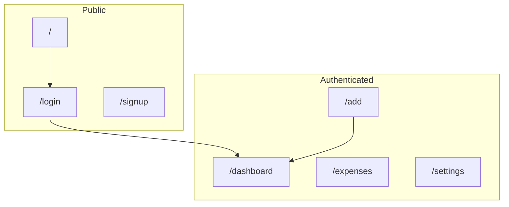
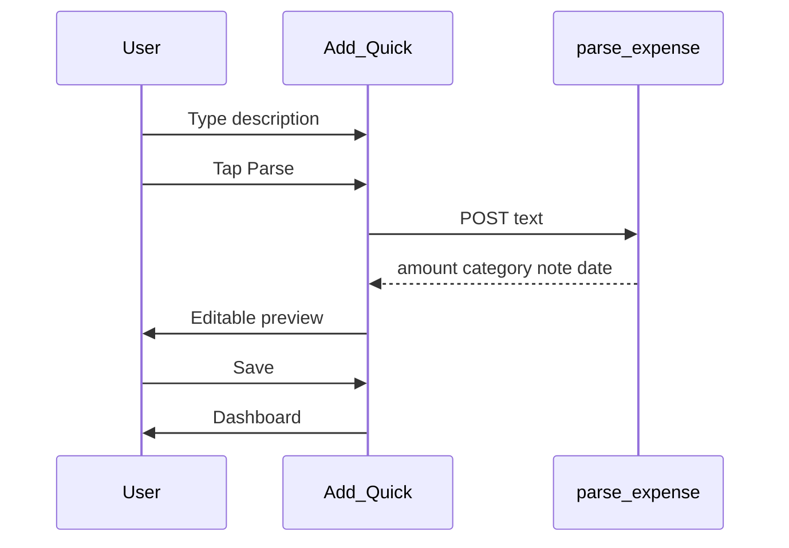
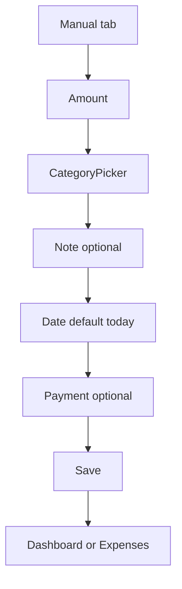

# Design Plan — PoysaPath

> **Companion:** [planning.md](./planning.md) · [planning-db.md](./planning-db.md)  
> **Security / AI disclosure:** [planning.md §3–4](./planning.md)  
> **Last updated:** May 18, 2026

## Current state

- Mobile-first (375px+), bottom nav: Home, Expenses, Add, More.
- `/add`: **Quick** (Gemini parse + preview) and **Manual** (no AI).
- Dashboard: totals, category breakdown, weekly insight, recent expenses.

---

## 1. Design goals

| Goal | Approach |
|------|----------|
| Fast logging | Dashboard → Add in ≤2 taps; Quick parse for NL input |
| Clear totals | Today + month on dashboard |
| Private accounts | No shared UI between users |
| Safe AI | Preview before save; Manual tab never calls Gemini |
| Mobile comfort | Bottom nav, 44px+ tap targets |

---

## 2. Sitemap

| Route | Auth | Notes |
|-------|------|-------|
| `/`, `/login`, `/signup` | Public | Logged in → `/dashboard` |
| `/dashboard`, `/add`, `/expenses`, `/settings`, … | Required | Middleware |

---

## 3. Core flows

### 3.1 Quick add (Gemini)

- Always **preview** before save; highlight parsed fields optional.
- Error: inline message + switch to Manual tab.
- Footer: description sent to Google AI (see privacy).

### 3.2 Manual add (no AI)

User picks category manually. No blur/API categorization.

### 3.3 Dashboard insight

- If cached insight for week → show card.
- Else POST `weekly-insight` → cache in DB.
- Refresh: manual, 24h cooldown (client + server rules).

### 3.4 Edit / delete

Expenses list → edit page → save or confirm delete. No AI.

### 3.5 Auth

Login, signup, forgot password, sign out from Settings.

---

## 4. Key screens

### Dashboard `/dashboard`

- Greeting, today + month cards.
- Insight card (if user has expenses).
- Category breakdown, recent list → edit.
- Empty state: CTA to `/add`.

### Add `/add`

| Tab | Content |
|-----|---------|
| **Quick** | Textarea, Parse button, then preview form (`ExpenseForm`) |
| **Manual** | Full `ExpenseForm` — amount, category, date, note, payment |

### Expenses `/expenses`

- Grouped list, tap to edit. Filter by category (month scope).

### Settings `/settings`

- Profile name, sign out, privacy/terms. CSV export hidden (API still exists).

---

## 5. Components

| Component | Used on |
|-----------|---------|
| `QuickAdd` | `/add` Quick tab |
| `ExpenseForm` | Manual tab, parse preview, edit |
| `InsightCard` | Dashboard |
| `CategoryPicker` | Expense form |
| `app-shell` | Bottom navigation |

---

## 6. UI tokens (summary)

- Surfaces: `bg-bg`, `bg-surface`, `border-border`
- Text: `text-text`, `text-text-muted`
- Accent: primary actions, active nav
- Danger: errors, delete
- Currency: `৳` + tabular nums

---

## 7. States and errors

| State | Pattern |
|-------|---------|
| Loading | Skeleton or button spinner |
| Empty | Short message + CTA |
| Gemini 429 | “AI busy — use manual entry or try later” |
| Auth error | Inline under form fields |

---

## 8. Gemini UX principles

1. Preview before persist (Quick tab only).
2. Manual tab is fully offline from AI.
3. EN / BN / Banglish supported on **parse** input only.
4. Insight uses aggregates, not full expense dump in prompt.

---

*Backlog UI: [post-deployment-changes/ui-suggestions.md](./post-deployment-changes/ui-suggestions.md).*
